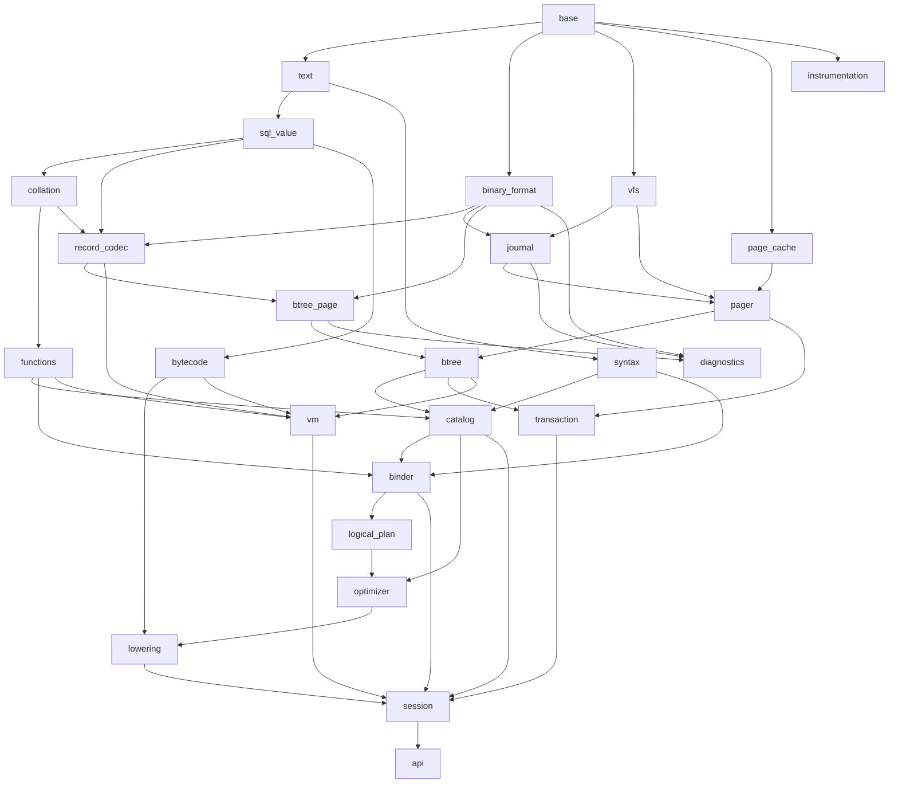

# Architecture

## Purpose

This document analyzes the pinned SQLite source tree, identifies the coupling
that prevents a direct topological implementation, and defines the target
architecture for Modern SQLite.

The reference is SQLite 3.54.0 at Fossil check-in
`65ec11f05a9ee5b23495427ece76c0550a8ffc28980a8a0c72d556ba0d2290e2`.

## Reference source scale

The pinned source tree contains:

- 80 non-test core C translation units under `src/`.
- 166,896 lines in those core C files.
- 1,195 top-level Tcl test scripts.
- 94 top-level build, generation, diagnostic, and test tools.
- A 6,031-line `src/sqliteInt.h` master internal header.
- 103 C files under `src/`, including test and binding files, that include
  `sqliteInt.h`.

The size is not the main difficulty. The main difficulty is that decades of
optimization have compressed several logical layers into shared structures,
callbacks, generated code, and mutable cross-layer state.

## Original SQLite architecture

The official high-level pipeline is:

```text
SQL text
  -> tokenizer
  -> parser
  -> semantic analysis and code generation
  -> query planner
  -> VDBE bytecode
  -> B-tree
  -> pager and page cache
  -> rollback journal or WAL
  -> VFS
```

### Source groups

| Area | Representative files | Responsibility |
|---|---|---|
| Public interface and connection lifecycle | `main.c`, `legacy.c`, `prepare.c`, `vdbeapi.c`, `table.c` | Open/close, prepare, step, bind, result access, configuration |
| Tokenization and grammar | `tokenize.c`, `parse.y` | Tokens, Lemon grammar, parser actions |
| AST and semantic analysis | `expr.c`, `resolve.c`, `walker.c`, `select.c` | Expression trees, name resolution, rewrites |
| Planning and code generation | `where*.c`, `select.c`, `build.c`, `insert.c`, `update.c`, `delete.c`, `trigger.c`, `fkey.c`, `window.c` | Access paths and VDBE program construction |
| Bytecode runtime | `vdbe.c`, `vdbeapi.c`, `vdbeaux.c`, `vdbemem.c`, `vdbesort.c` | Opcodes, registers, cursors, records, sorting |
| Storage engine | `btree.c`, `btree.h`, `btreeInt.h` | Table/index B-trees, overflow, freelist, cursors |
| Transactions and caching | `pager.c`, `pcache.c`, `pcache1.c`, `wal.c`, `memjournal.c` | Page lifetime, journaling, recovery, locking, WAL |
| Platform | `os.c`, `os_unix.c`, `os_win.c`, `memdb.c` | VFS, files, locks, shared memory, time, randomness |
| Runtime utilities | `malloc.c`, `mutex*.c`, `util.c`, `hash.c`, `bitvec.c`, `printf.c`, `utf.c`, `random.c`, `status.c` | Allocation, synchronization, containers, encoding, diagnostics |
| Extensions | `ext/` | FTS, R-tree, sessions, recovery, utilities |

### Generated source

SQLite's build generates:

- `parse.c` and `parse.h` from `parse.y` with Lemon.
- `opcodes.h` by scanning `vdbe.c`.
- `opcodes.c` from `opcodes.h`.
- `keywordhash.h` from the keyword generator.
- `pragma.h` from the pragma table generator.
- `sqlite3.h` from `sqlite.h.in`, version data, and source identity.
- The `sqlite3.c` amalgamation from the complete source set.

Generated artifacts are part of SQLite's build strategy, not architectural
boundaries that Modern SQLite must reproduce.

## Coupling that must not be copied

The original source is modular in intent, but it is not a dependency DAG at
the level required for an independently testable C++ implementation.

### Parser actions perform work beyond parsing

`parse.y` calls transaction, schema, DDL, DML, PRAGMA, and code-generation
routines directly. For example, transaction actions begin at
`src/parse.y:181`, column construction appears at `src/parse.y:253`, and index
creation actions appear around `src/parse.y:416`.

This prevents a pure syntax layer and makes parser tests depend on higher
layers.

### Planning and bytecode emission are interleaved

`where.c`, `wherecode.c`, and `select.c` choose algorithms while directly
emitting and patching VDBE instructions. The planner therefore has no stable
physical-plan output that can be tested independently from bytecode layout.

### B-tree and VDBE share record internals

The B-tree consumes VDBE-owned `KeyInfo`, `Mem`, and `UnpackedRecord` types and
calls VDBE record helpers:

- `src/btree.c:883-885` allocates and unpacks a VDBE record.
- `src/btree.c:6085` selects a VDBE record comparator.
- `src/btree.c:6228` compares an index key through VDBE logic.

The VM simultaneously calls the B-tree throughout `vdbe.c`, including cursor
opening at `src/vdbe.c:4596`. This is a logical cycle even though C headers and
the amalgamation make it buildable.

### Schema bootstrap calls the compiler recursively

Schema loading reads `sqlite_schema`, then recompiles stored `CREATE`
statements:

- `src/prepare.c:147` invokes `sqlite3Prepare()` while initializing schema.
- `src/prepare.c:394` queries schema rows through `sqlite3_exec()`.
- `src/prepare.c:800` invokes the parser for ordinary preparation.

The catalog depends on parsing, while ordinary binding depends on the catalog.
The cycle must be split into a pure parser, a catalog model, and a catalog
loader.

### Pager, cache, and WAL share concrete page types

- `src/pager.c:5088-5090` gives the cache a `pagerStress` callback.
- `src/wal.h:98` accepts a linked list of concrete `PgHdr` cache pages.
- `src/pager.c:3273-3275` passes that list directly into WAL.

Modern SQLite must replace this with narrow page views and explicit writeback
interfaces.

### Lower storage layers retain upper connection state

`Btree` stores a `sqlite3*`, and `BtShared` retains schema and connection
coordination state. Pager and WAL APIs also accept connection objects for
interrupt, error, and callback behavior.

Modern SQLite will pass narrow services or operation contexts instead of a
top-level session object.

## Compatibility boundaries

Modern SQLite will preserve, incrementally:

1. SQLite 3 database-file encoding and B-tree page semantics.
2. Record serialization, type affinity, collation, and NULL behavior.
3. Rollback-journal and later WAL recovery semantics.
4. Observable SQL results, errors, and transaction behavior for implemented
   features.
5. Interoperability with the pinned SQLite reference.

Modern SQLite will not preserve:

- SQLite's source-file boundaries.
- `sqliteInt.h`-style global internal visibility.
- Mutable AST nodes that acquire VM cursor and register numbers.
- SQLite VDBE opcode numbers or instruction layout.
- The amalgamation as the internal development architecture.
- C API source or ABI compatibility in the initial milestones.

SQLite's own opcode documentation states that VDBE bytecode is not a public
API and changes between releases. Observable behavior, not internal opcode
identity, is the compatibility contract.

## Target architecture

Arrows point from a prerequisite to a dependent module.



### Module responsibilities

| Module | Responsibility | Forbidden knowledge |
|---|---|---|
| `base` | Byte views, strong IDs, errors, results, assertions, allocation contracts | SQL, files, pages |
| `instrumentation` | Optional development-only counters and profiling hooks | Engine policy, persistent mutation |
| `text` | UTF-8 handling, source spans, ASCII/SQLite lexical classification | Catalog, storage |
| `sql_value` | NULL, integer, real, text, blob, affinity, conversion | B-tree, VM |
| `collation` | Collation contracts and comparison | Planner and storage policy |
| `functions` | Function metadata and implementations | Parser and storage internals |
| `binary_format` | Endian coding, varints, checksums, database/journal headers | Filesystem I/O |
| `record_codec` | SQLite records and index-key comparison | VM and B-tree ownership |
| `vfs` | Files, locks, shared memory, time, randomness, durability primitives | SQL and page layout |
| `page_cache` | Pinning, dirty state, replacement, memory pressure | Journaling policy |
| `journal` | Rollback/WAL contracts and durable frame or page operations | SQL and B-tree cells |
| `pager` | Page reads/writes, transaction page state, recovery ordering; the read-only subset has no journal dependency | SQL AST and query plans |
| `btree_page` | B-tree cells, overflow, freelist, page validation | Files and transactions |
| `btree` | Table/index cursors, balancing, root management | VM registers and AST |
| `syntax` | Tokens, immutable AST, parser diagnostics | Catalog mutation and bytecode |
| `catalog` | Schema model, `sqlite_schema` loading, statistics | Session and VM state |
| `bytecode` | Typed instructions and immutable executable programs | Parser implementation |
| `binder` | Name/type/function resolution into bound identifiers | VM and page structures |
| `logical_plan` | Relational and statement semantics | Bytecode addresses |
| `optimizer` | Access paths, join order, physical plan | VM instruction mutation |
| `lowering` | Physical plan to bytecode | Runtime execution state |
| `transaction` | Connection-level transaction and savepoint coordination | Parser details |
| `vm` | Registers, cursors, opcode execution, result suspension | AST and optimizer types |
| `session` | Open, prepare, step, reset, finalize, schema refresh | Platform implementation details |
| `api` | Public RAII C++ facade and later C compatibility layer | Internal ownership |
| `diagnostics` | Read-only format and storage inspection | Database mutation |

## Required design rules

1. No master internal header.
2. Public API headers are never included by lower layers.
3. Pure format code performs no I/O and is independently fuzzable.
4. External bytes are validated at decode boundaries.
5. Internal trusted invariants may use assertions only after ownership,
   lifetime, and invalidation rules are documented and tested.
6. Every storage handle uses RAII pinning or ownership.
7. Every persistent transition has an explicit sync ordering.
8. Every planner decision can be inspected before bytecode lowering.
9. Every VM program is immutable once execution begins.
10. Optional instrumentation compiles out of the normal production build.

## Planned source layout

```text
include/modern_sqlite/
src/
  base/
  instrumentation/
  text/
  runtime/
  format/
  platform/
  storage/
    cache/
    journal/
    pager/
    btree/
  sql/
    syntax/
    catalog/
    bytecode/
    binder/
    plan/
    optimizer/
    lowering/
    vm/
  session/
  diagnostics/
tests/
  unit/
  format/
  parser/
  differential/
  crash/
  fuzz/
  performance/
benchmarks/
tools/
project/
docs/
  adr/
```

## Verification strategy

Verification is layered rather than deferred:

- Unit tests for pure contracts and state transitions.
- Golden vectors generated independently by pinned SQLite.
- Differential SQL result and error tests.
- Bidirectional database-file interoperability.
- Deterministic VFS fault and power-loss injection.
- Property and coverage-guided fuzzing of decoders, parser, planner, and VM.
- Sanitizer and multi-compiler builds.
- Matched performance benchmarks and fixed-work diagnostics.
- `PRAGMA integrity_check` from pinned SQLite on databases written by Modern
  SQLite.

## Performance strategy

Performance work follows the methodology proven in the sibling Modern LevelDB
project:

1. Pin the native reference and record build provenance.
2. Match mechanisms before comparing implementations.
3. Use deterministic corpora, operation orders, and configuration.
4. Separate setup, prepare, warmup, execution, and verification.
5. Record wall time, process CPU, allocations, I/O, and operation counts.
6. Establish a baseline before optimizing.
7. Use profiles and fixed-work diagnostics to explain a gap.
8. Adopt a complete native mechanism cluster when its parts depend on one
   another; do not reject every piece through isolated microbenchmarks.
9. Require an ADR for each optimization or parity cluster.
10. Re-run correctness, corruption, crash, and non-target performance checks.

The first benchmark family will compare cache-fit and cache-pressure databases
for prepare, rowid lookup, indexed lookup, missing lookup, scan, batched insert,
update, delete, and commit. WAL and concurrent workloads are added only after
those features exist.

## Primary references

- <https://sqlite.org/arch.html>
- <https://sqlite.org/fileformat2.html>
- <https://sqlite.org/atomiccommit.html>
- <https://sqlite.org/opcode.html>
- <https://sqlite.org/optoverview.html>
- `src/btreeInt.h`
- `src/pager.c`
- `src/wal.c`
- `src/vdbe.c`
- `src/where*.c`
- `src/parse.y`
- `src/prepare.c`
